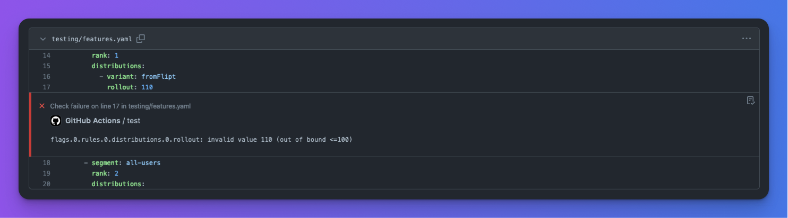

# Flipt Validate Action

This action validates Flipt [features.yaml](https://www.flipt.io/docs/experimental/filesystem-backends#defining-flag-state) files for syntax and semantic errors.



## Example

```yaml
# testing/features.yaml
namespace: default
flags:
  - key: flipt
    name: flipt
    description: flipt
    enabled: false
    variants:
      - key: flipt
        name: flipt
      - key: flipt
        name: flipt
    rules:
      - segment: internal-users
        rank: 1
        distributions:
          - variant: fromFlipt
            rollout: 110
      - segment: all-users
        rank: 2
        distributions:
          - variant: fromFlipt2
            rollout: 100
```

Would result in the following output:

```console
Validation failed!

- Message  : flags.0.rules.0.distributions.0.rollout: invalid value 110 (out of bound <=100)
  File     : testing/features.yaml
  Line     : 17
  Column   : 23
```

## Usage

```yaml
validate:
  runs-on: ubuntu-latest
  steps:
    # Checkout the target repository
    - uses: actions/checkout@v3

    - uses: flipt-io/validate-action@v0.1.0
      with:
        # Optional, the token to use for GitHub API requests
        # github-token: ${{ secrets.GITHUB_TOKEN }}
        # Optional, the directory to validate, defaults to the repository root
        # working-directory:
```

## Customizing

### inputs

Following inputs can be used as `step.with` keys

| Name                | Type   | Description                                                                |
| ------------------- | ------ | -------------------------------------------------------------------------- |
| `github-token`      | string | **Optional**. The token to use for GitHub API requests                     |
| `working-directory` | string | **Optional**. The directory to validate, defaults to the repository root   |
| `args`              | string | **Optional**. Additional arguments to pass to the `flipt validate` command |

## Development

```
# Builds the typescript code.
npm run build

# Runs eslint.
npm run lint

# Runs prettier.
npm run format

# Packages the code into the dist folder. Must be updated to pass CI on `main`.
npm run package

# Runs all of the above commands.
npm run all
```

## License

[Apache 2.0](LICENSE)
